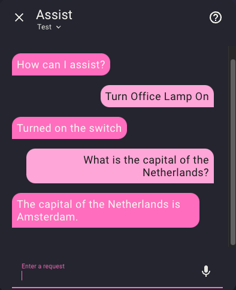
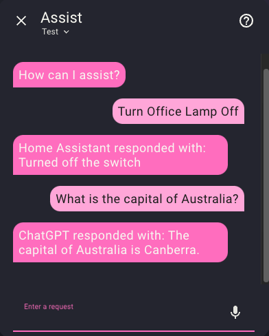

# This will not be maintained anymore, as it is now implemented within Home Assistant, making this redundant. 

Thank you for the support, and I am sorry for the slow maintenance of this over the last year due to burnout. I'm happy that I was able to provide functionality that was needed until Home Assistant implemented it themselves.

# Fallback Conversation Agent

This is a custom component of Home Assistant.

 

## Features

This custom component allows you to use two conversation agents, falling back if your primary agent fails to handle the intent.

An example use case of this is to use the built-in Home Assistant conversation agent to handle manipulating devices, but then fallback to using ChatGPT for example to handle general questions such as the capital of a country or measurement conversions.

The options provide 3 debug levels:
- No Debug: This silently handles fallback, and pipes back the raw response to you.
- Low Debug: This will add information such as what agent is responding to the response. This way you can determine if fallback is working as you expect.
- Verbose Debug: Will provide you with more information, including the error of the previous response.

## Installation

1. Install via registering as a custom repository of HACS or by copying the `fallback_conversation` folder into `<config>/custom_components`.
2. Restart Home Assistant.
3. Go to Settings > Devices & Services.
4. In the bottom right corner, select the Add Integration button.
5. Set a name and your preferred debug level.
6. Click on Fallback Conversation Agent and select Configure on your created agent.
7. Set the primary and fallback conversations agents from the list.
8. Go to Settings > Voice Assistants.
9. Click to edit Assistant (named "Home Assistant" by default).
10. Select the name of your Fallback Conversation Agent from the "Conversation agent" tab

## Contributors

Contributions are open. I would like to thank the following contributors:

- @t0bst4r
- @ov1d1u
